# Dashboard story pool — build plan (M blueprint)

**Status:** Source of truth for the **M** implementation pass.  
**Last aligned with:** Chunks **A–N** locked, **M1b** sequencing, **T1** / **R1** / **P1**, artifacts **A1** / **B1** / **C1**.

**Companion docs (do not duplicate rationale here):**

| Doc | Role |
|-----|------|
| [dashboard-story-pool-spec.md](dashboard-story-pool-spec.md) | Engineer contract (gates, SKUs, **T1** / **R1**) |
| [dashboard-story-pool-walkthrough.md](dashboard-story-pool-walkthrough.md) | Full design lock + chunk history |
| [dashboard-story-pool-scenario-map.md](dashboard-story-pool-scenario-map.md) | **L2a** living scenarios / tests index |
| [MODE2-SLICE-15-BETA-READINESS-CHECKLIST.md](../MODE2-SLICE-15-BETA-READINESS-CHECKLIST.md) | Local env + DC prototype § |
| [MODE2-SLICE-16-STAGING-HANDOFF.md](../MODE2-SLICE-16-STAGING-HANDOFF.md) | Staging env + DC prototype § |

---

## Goal

Ship the **post-fetch story pool** for DC prototype testing with **real models**, **FP-first** behavior, **auditable** last-run diagnostics, and **stable ordering** (**T1**, **R1**).

**In scope:** Commits **M1 → M7** (required), **M8** (optional).  
**Out of scope (this pass):** Post-grounding LLM meta-copy, **J5c** golden manifest, LLM beat-fit, `refresh_runs` table, ingestion redesign.

---

## Build sequence (**M1b** — real-first)

Execute in order. Each step: PR-sized, **`npm run test:api`** green (**N3a**).

```mermaid
flowchart LR
  M1[M1 Env docs] --> M2[M2 Real cluster SKU]
  M2 --> M3[M3 Model ids on _meta]
  M3 --> M3b[M3b P1 Persist diagnostics]
  M3b --> M4[M4 Haiku geo]
  M4 --> M5[M5 E3b lexical]
  M5 --> M6[M6 C2 sources]
  M6 --> M6b[M6b T1 R1 sort]
  M6b --> M7[M7 L2a map]
  M7 -.-> M8[M8 Optional cluster eval]
```

---

## Commit checklist

### M1 — DC prototype env (docs)

**Delivers:** Slice **15** + **16** sections for pool SKUs, keys, smoke steps.  
**Verify:** Operator can copy env block; `TEMPO_AI_MOCK_ONLY` unset for hand-testing.

| Check | Command / action |
|-------|------------------|
| Keys documented | Anthropic + OpenAI vars in Slice 15/16 |
| Smoke listed | `GET /api/ai/models`, refresh, `_meta` after M3 |

**Chunks:** **N2**, **C1**

---

### M2 — Real clustering SKU on refresh

**Delivers:** Staging/prototype uses `TEMPO_AI_CLUSTER_MODEL=anthropic:claude-sonnet-4-6` (env; optional: smart default when keys present).  
**Verify:** Refresh invokes real cluster path when env set (not `mock-anthropic-haiku`).

| Check | Expected |
|-------|----------|
| Env set | Sonnet string in router / logs |
| CI | Tests still pass with mocks in test env |

**Chunks:** **N2**, **I**

---

### M3 — Model ids on refresh `_meta`

**Delivers:** `_meta.clusterModel`, embedding model id on POST refresh + watermark-skip branch.  
**Verify:** Response `_meta` shows Sonnet + `text-embedding-3-small` (or env override).

**Chunks:** **L1a**, **N2**

---

### M3b — Persist last-run diagnostics (**P1**)

**Delivers:** On `writeSnapshot`, persist into snapshot `_meta`: `funnel`, `recall`, `beatFit`, `clusterModel`, embedding model id (same shape as refresh).  
**Verify:** `GET /api/dashboard` returns persisted funnel/recall/beatFit without re-running pipeline.

| Check | Expected |
|-------|----------|
| After refresh + GET | `_meta.funnel` present on read |
| Order | Matches last successful run |

**Chunks:** **L** (audit)

---

### M4 — Haiku geo assessor

**Delivers:** Real `geoAssessFn` (Haiku structured confidence); inject in `server.mjs` (replace mock).  
**Verify:** Tests with stubbed LLM; manual refresh with geo list configured.

**Chunks:** **F3b**, **N2**

---

### M5 — Empty profile → lexical (**E3b**)

**Delivers:** `buildProfileText` empty → return lexical items + `empty_profile_text_lexical_only` (not fail-closed).  
**Verify:** Update `embedding-recall` tests; pipeline test if applicable.

**Chunks:** **E3b**

---

### M6 — Zero sources fail-closed (**C2**)

**Delivers:** `selectSourcePool` + manifest path: both source lists empty → `[]`.  
**Verify:** Tests; no “all outlets” leak.

**Chunks:** **C2**

---

### M6b — **T1** + **R1** ordering

**Delivers:**

- **T1:** In `buildStory`, sort `sources[]`: `weight` ↓ → `minutesAgo` ↑ → stable `sourceId`.
- **R1:** Before snapshot write, sort `stories[]`: max `beatFitScore` → min `minutesAgo` → `metaStoryId`.

**Verify:**

| Check | Expected |
|-------|----------|
| Unit tests | Order assertions on fixture payload |
| Prototype | No client re-sort of cards; `keySources()` consistent with T1 or delegated to server order |
| R1 | `beatFitScore` available on items at build time |

**Chunks:** **T1**, **R1**

---

### M7 — Extend L2a scenario map (docs)

**Delivers:** New rows in [scenario map](dashboard-story-pool-scenario-map.md) from DC/build findings.  
**Verify:** G1–G5 linked to tests; any new drop reasons logged.

**Chunks:** **L2a**, **J5a**, **B1**

---

### M8 — Cluster eval smoke *(optional)*

**Delivers:** Minimal Sonnet clustering shape check / script.  
**When:** Only if DC sessions need it before goldens exist.

**Chunks:** **N3a**, **I**

---

## End-to-end verification (after M3b + M6b minimum)

Run once real keys and feeds are healthy:

0. **Pre-M7 hard gate (required):** story-pool validation must run in **real-model mode**.
   - `GET /api/ai/models` must show `mockOnly: false` **and** real capability routing for story-pool paths (no accidental `mock-*` for clustering/classification in DC validation mode).
   - Keys must be configured via env/secret manager (`TEMPO_ANTHROPIC_API_KEY`, `TEMPO_OPENAI_API_KEY` as applicable).  
   - Documentation must include key **variable names only** (never raw secret values).
1. **Ingestion:** `GET /api/ingestion/sources` — feeds present, manifest sane.
2. **Models:** `GET /api/ai/models` → `mockOnly: false`.
3. **Refresh:** `POST /api/dashboard/refresh` — stories or strict-empty with funnel in `_meta`.
4. **Persist:** `GET /api/dashboard` — `_meta.funnel`, `_meta.recall`, `_meta.beatFit`, `clusterModel` from last run.
5. **Ordering:** `stories[0]` = highest beat-fit cluster; `stories[0].sources[0]` = lead by weight/recency.
6. **Grounding rejects:** Row in `story_rejections` when cluster hallucinates (Supabase path).
7. **Tests:** `cd 05-engineering && npm run test:api`
8. **Onboarding (if touched):** `npm run eval:onboarding-extraction`

---

## Spec ↔ code tracker (close by M6)

| Spec | Commit | Done |
|------|--------|------|
| **N2** Sonnet cluster | M2, M3 | ☐ |
| **L1a** + **P1** `_meta` | M3, M3b | ☐ |
| **F3b** geo Haiku | M4 | ☐ |
| **E3b** empty profile lexical | M5 | ☐ |
| **C2** zero sources | M6 | ☐ |
| **T1** / **R1** order | M6b | ☐ |

**Already aligned (regression only):** J1a–J3b, K1a, G/H/I unit tests.

---

## Workflow notes

- **Review:** Build with Claude; review with Codex (per team preference).
- **Commits:** One row in the table above per PR when possible.
- **Do not re-open** chunks A–N for M work; log product changes as spec amendments to [pool spec](dashboard-story-pool-spec.md).
- **Golden pool evals:** Incremental per **B1** after M4+; not blocking M1.
- **Key hygiene:** Never commit or document raw API keys in Markdown/docs; keep secrets only in env files or secret managers.

---

## Open implementation toggles (resolve in PR, not design)

| Toggle | Options |
|--------|---------|
| M2 default | Env-only vs auto-real when keys detected |
| M3 shape | `_meta.embeddingModel` vs `_meta.recall.embeddingModel` |
| T1 tie-break | Ascending `sourceId` for stability |

---

## Changelog

| Date | Change |
|------|--------|
| 2026-05-15 | Initial blueprint: M1b, T1, R1, P1, A1/B1/C1, M1–M8 |
