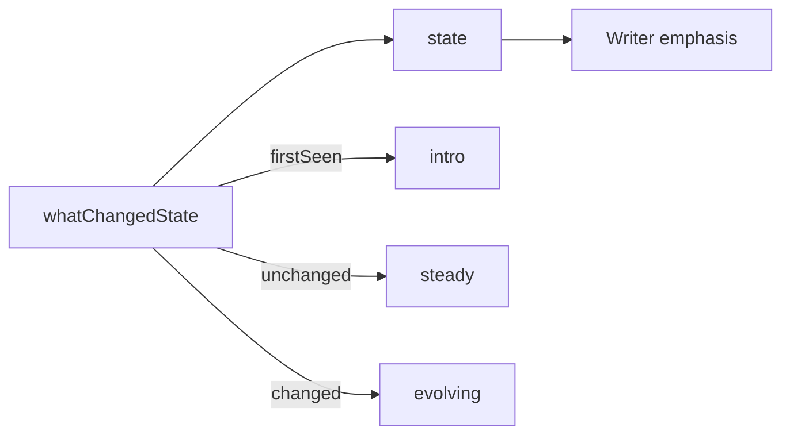
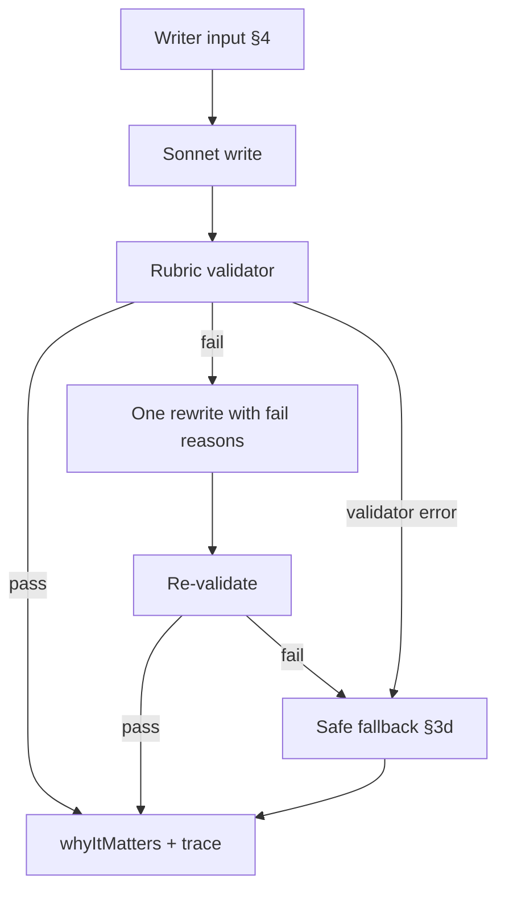

# Why this matters — engineer spec (v0, planning)

**Status:** Draft (planning complete — ready for implementation)  
**Owner:** Felipe  
**Last updated:** 20 May 26  

**Product source:** [Why this matters — strategy spec](../../03-prd/why-this-matters--strategy-spec.md)  
**Eval set:** [why-this-matters-eval-set-v0.json](../../03-prd/why-this-matters-eval-set-v0.json) (18 cases, locked)

**Phases:** §1–12 locked (planning complete)

**Current code (interim):** [`buildStory`](../apps/api/src/dashboard/refresh-pipeline.mjs) still sets `whyItMatters: metaStory.subtitle` — **to be removed** when this spec ships; subtitle echo is not an acceptable steady state.

**Related:** [What changed — engineer spec (v1)](what-changed-spec.md)

---

## Table of contents

| § | Topic | Status |
|---|--------|--------|
| 1 | Purpose & posture | locked |
| 2 | Vocabulary | locked |
| 3 | State machine (whatChanged coupling) | locked |
| 4 | Writer inputs / payload | locked |
| 5 | Doctrine retrieval (v0) | locked |
| 6 | LLM writer + validation loop | locked |
| 7 | Trace + persistence | locked |
| 8 | Pipeline integration | locked |
| 9 | Env flags + feature gate | locked |
| 10 | Eval harness | locked |
| 11 | Mock / CI | locked |
| 12 | Open questions | locked |

---

## 1. Purpose & posture (locked 20 May 26)

### Purpose

Generate `story.whyItMatters` as **monitoring posture + comms readiness** implications — not recap (**Summary**), not user-relative delta (**What changed**), not deck placement (**Subtitle**).

### Posture

- **Fail-closed** on weak evidence: prefer conservative wording or safe fallback over strong inference.
- **Neutral bilateral** framing (no US-vs-Colombia side-taking).
- **Non-prescriptive** (posture/readiness language, not tasking).
- **Trust over cleverness:** a wrong implications line is worse than a quiet fallback.

### Scope (in)

- New writer module, rubric validator, and server-side trace per meta-story.
- Wire into refresh pipeline **after** meta-story fields and `whatChanged` are resolved.
- Eval runner against the locked 18-case regression set.
- Feature flag **on by default** for prototype via `bootstrapApiEnv()` (§9); explicit off = operator kill-switch.

### Scope (out)

- Frontend / wire-shape changes (`whyItMatters` already exists on [`StoryDto`](../packages/contracts/src/schemas.ts)).
- Persona detection, geo-side inference, or role pickers.
- Broad external doctrine corpus (MVP = internal-first allowlist per strategy §3a).
- Changes to Summary, What changed, Subtitle, or title-lock behavior.

### Trust contract

1. Output must pass the Phase 4 writer rubric **or** ship a Phase 3d safe-fallback template (never empty, never directive recap).
2. Output must not duplicate **Summary** or **What changed** verbatim (eval + validator enforced).
3. **State** (`intro` / `steady` / `evolving`) is derived from **whatChanged** coupling (Phase 2), not re-inferred by the writer.

### Implementation map (target)

| Concern | Module (to create) |
|---------|-------------------|
| Writer + rubric | `why-this-matters-engine.mjs` (name TBD) |
| Pipeline call site | [`runRefreshPipeline`](../apps/api/src/dashboard/refresh-pipeline.mjs) after whatChanged loop |
| Eval runner | `apps/api/src/ai/evals/run-why-this-matters-eval.mjs` (name TBD) |
| Env config | `TEMPO_AI_WHY_IT_MATTERS_*` (§9; bootstrap default on in non-test) |

---

## 2. Vocabulary (locked 20 May 26)

| Term | Meaning |
|------|---------|
| **`metaStoryId`** | Stable cluster identifier (same as [what-changed spec](what-changed-spec.md)). |
| **`state`** | `intro` \| `steady` \| `evolving` — drives writer **emphasis** (Phase 4b), not which facts exist. |
| **`whatChangedState`** | `firstSeen` \| `unchanged` \| `changed` — canonical delta enum from the what-changed engine. |
| **`taxonomyPrimary`** | One of six MVP implication categories (see strategy §1a). |
| **`confidence`** | `high` \| `medium` \| `low` — caps assertion strength in generated copy. |
| **`evidenceRefs`** | Structured grounding features (`sourceCount`, `uniqueOutletCount`, `framingDivergence`, `cadenceSignal`, `summaryChars`). |
| **`doctrineRefs`** | Doctrine snippet ids that influenced framing; may be `[]`. |
| **`trace`** | Server-side generation record (strategy §3c); **not** exposed in API response for MVP. |
| **`rubric pass`** | All eight Phase 4a checks pass and no auto-fail phrase hit. |
| **`safe fallback`** | Phase 3d template copy when writer or validator fails after one rewrite. |
| **`referenceGolden`** | Eval-set anchor line for regression; semantic match + rubric pass, not exact string equality. |
| **`trapGolden`** | Group C bad copy the eval must **reject**. |

---

## 3. State machine (locked 20 May 26)

`state` is **derived**, not writer-invented. The implications engine reads `whatChangedState` from the what-changed resolver (or fail-closed default when delta is missing).

### Mapping

| `whatChangedState` | `state` | Writer emphasis (Phase 4b) |
|--------------------|---------|----------------------------|
| `firstSeen` | `intro` | Baseline relevance; no escalation alarm |
| `unchanged` | `steady` | Ongoing relevance; no fresh-movement implication |
| `changed` | `evolving` | Implication shift tied to movement; do not re-report the delta line |

### Fail-closed when delta unavailable

When `whatChanged` / `whatChangedState` cannot be resolved (timeout, engine off, parse failure):

- `metaStoryId` ∉ ever-seen → **`intro`**
- `metaStoryId` ∈ ever-seen → **`steady`**

(See eval-D02. Do not infer `evolving` without a `changed` signal.)

### Invariant

**State changes emphasis, not facts.** The writer sees the same `subtitle`, `summary`, and `evidenceRefs`; only tone guardrails and taxonomy priors shift by `state`.



---

## 4. Writer inputs / payload (locked 20 May 26)

### Per-story writer input

Built once per shipped story, immediately before the implications call:

| Field | Source | Notes |
|-------|--------|-------|
| `metaStoryId` | lineage (`reuseOrAssignIds`) | Trace key |
| `title` | `metaStory.title` | Context for writer; **not** echoed in output |
| `subtitle` | `metaStory.subtitle` | Deck line — boundary: do not duplicate |
| `summary` | `metaStory.summary` | Narrative synthesis — boundary: do not recap |
| `whatChanged` | `resolveWhatChanged` output string | User-relative delta — boundary: do not duplicate |
| `state` | §3 mapping from `whatChangedState` | Drives emphasis guardrails |
| `whatChangedState` | what-changed engine enum | Stored on trace |
| `evidenceRefs` | computed at write time | See [EvidenceRefs](#evidencerefs) |
| `doctrineSnippets` | doctrine retrieval (§5) | May be `[]`; frames posture, does not invent facts |

### EvidenceRefs

```json
{
  "summaryChars": 312,
  "sourceCount": 4,
  "uniqueOutletCount": 3,
  "framingDivergence": "low",
  "cadenceSignal": "stable"
}
```

Enums: `framingDivergence` → `low|medium|high`; `cadenceSignal` → `stable|accelerating|decelerating`.

### Output

| Field | Where |
|-------|--------|
| `whyItMatters` | `story.whyItMatters` on API payload |
| `trace` | Server-side only (§7); includes `taxonomyPrimary`, `confidence`, `doctrineRefs`, `evidenceRefs`, writer versions |

### Explicitly excluded (MVP)

- Prior-snapshot story objects (state comes from current delta only).
- Raw `sources[].body` / full article text (summary + evidenceRefs are the grounding surface).
- End-user persona, geo-side, or settings beyond doctrine allowlist match.

---

## 5. Doctrine retrieval (v0, locked 20 May 26)

### Corpus (strategy §3a)

- **Allowlist-only** internal research + feature canon; optional ≤2 pre-vetted external snippets.
- Each snippet carries metadata: `id`, `topics[]`, `geographies[]`, `keywords[]` (optional), optional `stateVariant` (`intro`|`steady`|`evolving`).

### Matching rules (MVP)

**Primary gate** — snippet is eligible if **any** of:

- `story.topic` overlaps snippet `topics[]`, or
- `story.geographies` overlaps snippet `geographies[]`

**Secondary narrow** (when story has keywords):

- If `story.tags.keywords.length > 0`, prefer snippets with **≥1 keyword overlap**.
- If **no** story keywords, skip keyword filter (do not block retrieval).

**Ranking** (among eligible snippets):

1. Keyword overlap count (desc)
2. Geography overlap count (desc)
3. State-specific variant match (if snippet has `stateVariant`)

**Cap:** return top **0–3** snippets as `doctrineSnippets[]`; if none match → `[]`.

### Failure behavior

| Condition | Behavior |
|-----------|----------|
| Retrieval error / timeout | `doctrineSnippets: []`, continue publish |
| No matches | `doctrineSnippets: []`, continue publish |
| `doctrineAvailable: false` (eval-D01) | Skip retrieval; `doctrineRefs: []` |

### Usage contract (strategy §3b)

- Doctrine **frames** posture language and taxonomy emphasis.
- **Evidence wins** on facts: summary + `evidenceRefs` + delta state ground claims.
- Writer must pass: “Would this implication still hold if doctrine were removed?”

### Trace

- `doctrineRefs: string[]` — snippet ids actually passed to the writer (may be empty).

---

## 6. LLM writer + validation loop (locked 20 May 26)

### Product path (normal)

**LLM-first:** write → validate → one rewrite → Phase 3d template only if still failing. See §9 for env/bootstrap. **Never** `metaStory.subtitle`.

**Kill-switch:** `TEMPO_AI_WHY_IT_MATTERS_ENABLED=false` → skip LLM, ship deterministic templates only (operator rollback / CI cost control).

**Migration:** Remove `whyItMatters: metaStory.subtitle` from `buildStory`; use a schema-valid placeholder overwritten every refresh (like `whatChanged`).

### Stages (per shipped story)



| Step | Behavior |
|------|----------|
| **1. Write** | Single Sonnet call. Input: §4 payload + `doctrineSnippets`. Output: prose + proposed `taxonomyPrimary` + `confidence`. |
| **2. Validate** | Deterministic Phase 4a checks, auto-fail phrase list, near-duplicate check vs `subtitle` / `summary` / `whatChanged`. |
| **3. Rewrite** | **At most one** retry; inject `failReasons[]` into prompt. |
| **4. Fallback** | Phase 3d state template; set `fallback_used: true`; if evidence thin, `taxonomyPrimary: signal_uncertainty`, `confidence: low`. |

### Fail-closed rules

- Validator throws / times out → **fallback**, not silent pass.
- Do **not** ship directive, side-taking, or recap-as-main copy.
- Kill-switch off → **no LLM spend**; deterministic state fallback only (not subtitle).

### Test harness hooks

| Flag | Use |
|------|-----|
| `forceWriterFail: true` | eval-D03: force rubric fail after write → fallback path |
| `doctrineAvailable: false` | eval-D01: skip retrieval |

### Model posture

- **One** generation model for MVP (Sonnet-class), no separate classify stage (unlike what-changed Haiku→Sonnet split).
- Prompt must see structured diff boundaries: “do not repeat subtitle, summary, or whatChanged lines.”

---

## 7. Trace + persistence (locked 20 May 26)

### Per-story trace shape

Written at generation time (strategy §3c). **Not** included in the API response for MVP.

| Field | Required | Notes |
|-------|----------|-------|
| `metaStoryId` | yes | Cluster key |
| `state` | yes | `intro` \| `steady` \| `evolving` |
| `whatChangedState` | yes | `firstSeen` \| `unchanged` \| `changed` \| `null` when unknown |
| `taxonomyPrimary` | yes | Six MVP categories |
| `confidence` | yes | `high` \| `medium` \| `low` |
| `evidenceRefs` | yes | §4 object |
| `doctrineRefs` | yes | May be `[]` |
| `fallback_used` | yes | `true` only on safe-fallback path |
| `writerVersion` | yes | Engine package version |
| `promptVersion` | yes | Prompt template id |
| `generatedAt` | yes | ISO timestamp |
| `taxonomySecondary` | no | Optional |

### Where stored (MVP)

**`_whyItMattersTraces: Record<string, WhyItMattersTrace>`** on the persisted snapshot blob, keyed by `metaStoryId`.

- **Merge:** replace entries for `metaStoryId`s shipped this run; retain prior entries for stories off-dashboard (optional prune post-MVP).
- **Strip:** add to [`stripPersistedFields`](../apps/api/src/server.mjs) alongside `_everSeenMetaStoryIds`, `_selectionMeta`, etc.
- **Lift:** optional helper in [`dashboard-snapshot-repo.mjs`](../apps/api/src/db/dashboard-snapshot-repo.mjs) for debug routes / eval replay.

### Run-level diagnostics

Emit `log.whyItMatters` on each refresh:

| Field | Meaning |
|-------|---------|
| `enabled` | Flag on/off |
| `storiesAttempted` | Shipped stories processed |
| `pass` | Rubric pass without fallback |
| `fallback` | Safe-fallback count |
| `hardFail` | Should be 0 in production (caught before ship) |
| `lowConfidence` | `confidence: low` count |

Console line: `[pipeline.whyItMatters] enabled=… pass=… fallback=…`.

---

## 8. Pipeline integration (locked 20 May 26)

### Where the engine runs

Inside [`runRefreshPipeline`](../apps/api/src/dashboard/refresh-pipeline.mjs), **after** the “Phase 4: compute whatChanged per story” loop and **before** `summarizeFunnel` / return.

**Why after whatChanged:** `state`, `whatChangedState`, and the final `whatChanged` string must exist before implications run.

### Integration order (delta)

```
… → buildStory (placeholder whyItMatters)
→ R1 sort → semantic tag overlay
→ compute whatChanged per story
→ compute whyItMatters per story   ← NEW
→ summarizeFunnel / return
```

### Per-story loop

For each shipped story in R1 order:

1. Derive `state` from `whatChangedState` (§3).
2. Build §4 writer input (`evidenceRefs` from current story + sources).
3. If flag **on**: doctrine retrieve (§5) → `resolveWhyItMatters` (§6).
4. If flag **off**: assign deterministic Phase 3d template for `state` (no LLM).
5. Set `story.whyItMatters` and merge `_whyItMattersTraces[metaStoryId]`.

### buildStory change (required)

- **Remove** `whyItMatters: metaStory.subtitle` — subtitle echo is **not** allowed in any mode.
- Set a schema-valid **placeholder** in `buildStory` (e.g. intro safe-fallback string); pipeline **always** overwrites before return (same pattern as `whatChanged`).

### Watermark short-circuit

When the pipeline short-circuits on watermark match, re-serve the prior snapshot’s `whyItMatters` strings and `_whyItMattersTraces` verbatim (same posture as prior `whatChanged`).

### Why not in buildStory

`buildStory` stays synchronous; implications may be async when the flag is on. Prior snapshot is already in pipeline scope for state/delta.

---

## 9. Env flags + feature gate (locked 20 May 26)

### `TEMPO_AI_WHY_IT_MATTERS_ENABLED`

| Context | Default | Behavior |
|---------|---------|----------|
| **Committed `.env.example`** | `false` documented | Safe rollback reference for operators |
| **`bootstrapApiEnv()`** ([`server.mjs`](../apps/api/src/server.mjs)) | When **unset** and `NODE_ENV !== "test"` → **`"true"`** | Prototype/dev: LLM-first implications (mirrors `TEMPO_AI_DELTA_ENABLED`) |
| **`NODE_ENV=test`** | Unset unless test sets it | Tests control env explicitly |
| **Truthy values** | `"true"` or `"1"` (case-insensitive) | Full §6 loop |
| **Explicit `false`** | Operator kill-switch | Deterministic Phase 3d templates only; no LLM spend |

**Product posture:** Users should see **tailored LLM implications** on every refresh in normal prototype/prod configuration. Templates are the **failure/rollback** path, not the default experience.

### Model + timeouts

| Env | Default | Notes |
|-----|---------|-------|
| `TEMPO_AI_WHY_IT_MATTERS_MODEL` | `anthropic:claude-sonnet-4-6` | Single writer stage (no Haiku classify split) |
| `TEMPO_AI_WHY_IT_MATTERS_TIMEOUT_MS` | **`4000`** | Per LLM call. Anchored above delta write (`2500`) and geo assess (`3000`); below cluster/extraction (`15000`). |
| Per-story budget (implementation) | **`8000`** hard cap | Write + one rewrite combined; prevents unbounded refresh latency |

On per-call timeout, provider error, or missing API key → Phase 3d safe fallback (§6), `fallback_used: true`.

### CI / provider readiness

- **Do not** use subtitle echo in any environment.
- **`TEMPO_AI_MOCK_ONLY` is not deprecated** — it still forces mock providers via [`providerFor`](../apps/api/src/ai/model-router.mjs). Use for CI safety / no-key smoke only; **unset for DC/prototype hand-testing** (same as what-changed handoff).
- When mock-only or provider not ready: treat as LLM failure → deterministic template (not a separate product mode).
- **Eval job** (`npm run eval:why-this-matters`, TBD): runs the locked [18-case set](../../03-prd/why-this-matters-eval-set-v0.json) with real or injected writer; may set `ENABLED=true` explicitly.

### Rollback

`TEMPO_AI_WHY_IT_MATTERS_ENABLED=false` + restart → next refresh ships template-only implications. No migration, no schema change.

---

## 10. Eval harness (locked 20 May 26)

### Dataset

[why-this-matters-eval-set-v0.json](../../03-prd/why-this-matters-eval-set-v0.json) — **18 locked cases** (A:6 goldens, B:4 edges, C:4 failure probes, D:4 ops paths). Synthetic inputs; Group A = release blocker.

### Runner

| Artifact | Path |
|----------|------|
| Eval script | `apps/api/src/ai/evals/run-why-this-matters-eval.mjs` (to create) |
| npm script | `eval:why-this-matters` in [`apps/api/package.json`](../apps/api/package.json) |
| Shared utilities | [`eval-utils.mjs`](../apps/api/src/ai/evals/eval-utils.mjs) (dimension scoring helpers) |

**Flow per case:**

1. Load case `input` + `expected`.
2. Run `resolveWhyItMatters` (or validator-only for Group C trap goldens).
3. Score Phase 5a dimensions + meta (`trace_complete`, `fallback_used`).
4. Compare to `expectedPass`, `expectedTaxonomyPrimary`, `expectedFailDimension` (C), `expectFallbackUsed` (D03).

### Release gates (strategy §5b)

| Metric | MVP target | Blocker |
|--------|------------|---------|
| Pass rate overall | ≥ 90% | Yes if below on two consecutive runs |
| Group A pass rate | **100%** | **Yes — any A failure blocks release** |
| Hard-fail rate | ≤ 2% | Yes |
| Fallback rate | ≤ 10% | Warn |
| Duplication failures | ≤ 5% | Warn |
| Label mismatch rate (taxonomy / confidence) | tracked | **Warn only (MVP policy)** |

### MVP gate policy — label-match is monitored, not blocking

For the MVP pilot, **user-facing prose quality and safety are the gate**: rubric outcomes (`role_fit`, `non_duplication`, `non_prescriptive`, `neutral_framing`, `evidence_discipline`, `length`, `taxonomy_fit`, `state_coherence`), hard-fail patterns, and fallback discipline. Exact-label matching against `expectedTaxonomyPrimary` / `expectedConfidence` is **recorded on each row as `labelMismatches[]` and aggregated as `labelMismatchCount` / `labelMismatchRate`**, but does not push a row to `pass: false` and does not block the gate.

Clarification: `taxonomy_fit` is the rubric check that the emitted taxonomy value is valid and coherent with constraints; `taxonomy_mismatch` is the eval-only comparison against the case's expected label, which is monitor-only under MVP default.

**Why:** The six taxonomy categories cluster ambiguously around real coverage signals (a story can read as both `monitoring_intensity` and `stakeholder_exposure`). At MVP scale we want to ship safe, well-written implications copy first; label-fidelity tuning is a slower, separate workstream that benefits from longitudinal data.

**Escape hatch — restore strict label matching:**

```
EVAL_STRICT_LABEL_MATCH=true npm run eval:why-this-matters
# or
npm run eval:why-this-matters -- --strict-labels
```

Under strict mode the gate behavior matches the original spec (label mismatches flow into `failReasons[]` and can push Group A pass rate below 100%, which blocks).

### CI integration

- Run on PRs that touch `why-this-matters-engine.mjs`, refresh-pipeline implications step, or eval set JSON.
- `NODE_ENV=test` may inject mock writer; **Group A** should also pass in staging eval with real model before prod promotion.
- Emit junit/summary: per-group pass counts + failed case ids.

---

## 11. Mock / CI (locked 20 May 26)

| Mode | Behavior |
|------|----------|
| **`NODE_ENV=test`** | `bootstrapApiEnv()` does not force `ENABLED`; pipeline tests use stubs/mocks for deterministic assertions |
| **`TEMPO_AI_MOCK_ONLY=true`** | [`providerFor`](../apps/api/src/ai/model-router.mjs) routes to mocks → treated as LLM failure → Phase 3d templates. For CI safety / no-key smoke only — **unset for prototype hand-testing** |
| **`TEMPO_AI_WHY_IT_MATTERS_ENABLED=false`** | Explicit kill-switch in tests that need template-only path without mocking providers |
| **Eval runner** | May use injected mock writer for fast unit runs; staging promotion requires real-model pass on Group A |
| **`forceWriterFail: true`** | Test-only input flag (eval-D03); forces rubric fail → fallback path |

**Invariant:** No environment ships `whyItMatters: subtitle`. Mock/CI paths still overwrite with template or stubbed LLM output.

---

## 12. Open questions

### 12.1 · Doctrine corpus file format — **locked: A (JSON allowlist)**

**Decision:** MVP uses a hand-curated **`doctrine-snippets.v0.json`** allowlist with per-snippet metadata (`id`, `topics[]`, `geographies[]`, `keywords[]`, optional `stateVariant`, `body`).

**Rationale:** Matches §5 retrieval (topic/geo primary, keywords secondary) and is easy to test. Source content is distilled from strategy §3a canon (interview synthesis, this spec); markdown paths may be noted in snippet `provenance` but are not parsed at runtime in MVP.

**Target path (implementation):** `apps/api/src/dashboard/doctrine-snippets.v0.json` (or `05-engineering/packages/...` if shared — pick at implement time).

**Defer:** Hybrid markdown-chunk index (option C) until corpus exceeds ~15 snippets.

### 12.2 · Per-story LLM concurrency — **locked: serial**

**Decision:** Run implications **one story at a time** in `metaStoryId` order (same posture as the what-changed per-story loop).

**Rationale:** Simplest failure semantics, predictable refresh latency, avoids Anthropic rate-limit spikes on large dashboards. Revisit bounded parallel (e.g. pool of 3) only if measured refresh p95 exceeds product budget.

### 12.3 · Trace retention — **locked: replace per run (A)**

**Decision:** On each successful snapshot write, `_whyItMattersTraces` contains **only** entries for `metaStoryId`s in the current `payload.stories`. Off-dashboard ids are dropped.

**Re-entry behavior:** When a story reappears, `whyItMatters` is **regenerated** from current inputs (not restored from a prior trace). `whatChanged` / ever-seen still govern state (re-entry ≠ intro). Prior traces are not kept for longitudinal analytics in MVP.

### 12.4 · Eval golden matching — **locked: rubric-only (A)**

**Decision:** Automated eval **pass** = Phase 5a dimension scores + `expectedPass` / `expectedFailDimension` (Group C) / `expectFallbackUsed` (D03). **`referenceGolden` is not an exact-string match** — it is a human anchor and prompt-quality reference only. Taxonomy / confidence label match is policy-gated by §10 (monitor-only under MVP default; opt-in strict mode via `EVAL_STRICT_LABEL_MATCH`).

**Group C exception:** `trapGolden` strings are used to assert the **validator rejects** that exact failure mode (or near-duplicate), not to score good copy.

**Defer:** Embedding similarity (option C) until we see rubric-only pass rate too loose in practice.
