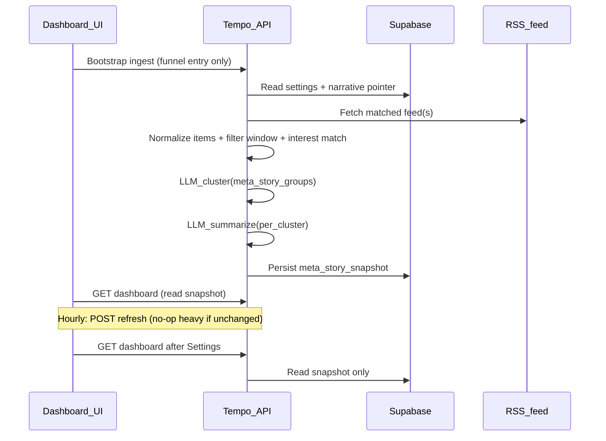

# RSS → meta-stories (incremental plan)

> **Reconcile with `server.mjs`:** The “Where you are today” section below is partly historical. The API now has **persisted snapshots**, `**POST /api/dashboard/refresh`**, clustering/grounding, and title locks—refresh the opening bullets when planning the next increment.

## Where you are today (repo-grounded)

- **Onboarding → Supabase:** Raw narrative goes to `user_onboarding_narratives`; settings upsert is atomic via RPC `[save_settings_with_narrative](../apps/api/src/db/atomic-settings-save.mjs)`. Post-save LLM extraction merges topics/keywords/geographies/sources into `settings.data` (see [onboarding-extractor.mjs](../apps/api/src/ai/onboarding-extractor.mjs)).
- **Dashboard API:** `[GET /api/dashboard](../apps/api/src/server.mjs)` reads fixture JSON via [feed-reader.mjs](../apps/api/src/ingestion/feed-reader.mjs) (`source-items.json`). [source-feeds.json](../apps/api/data/source-feeds.json) lists RSS URLs but is not fetched yet (_note in file).
- **Filtering today:** `buildDashboardPayload` in server filters normalized items by topics, geographies, and outlet name (`traditionalSources` ∪ `socialSources`). **Keywords are stored but not used for matching yet.**
- **“Meta-story” today:** Items carry a required **clusterId**; clustering is not computed from RSS—fixtures pre-assign groups. `summarizeCluster` runs after grouping.
- **UI:** [Dashboard.tsx](../../04-prototype/src/pages/Dashboard.tsx) loads `/api/dashboard` on mount (unless `?empty=1`). Pill filters use static `TOPICS` / `GEOGRAPHIES` from [@/data/stories](../../04-prototype/src/data/stories)—not yet driven by “tags present on returned meta-stories.”

---

## Your target behavior (captured as requirements)

- **Sources:** For a user, only ingest from the subset of feeds that correspond to extracted `traditionalSources` / `socialSources` (“source B not A/C/D”). For slice 1, interpret this as: match outlet/display names to entries in `source-feeds.json` (and allow exactly one active RSS feed first if mapping is ambiguous).
- **Time window:** Only items with published time in **now − X … now** (define X as a constant first—e.g. 24h or 72h—tune later).
- **Interest matching:** Within that window, keep items that align with user topics, keywords, geographies (today’s API only uses topics/geo/outlet—extend matching to keywords for parity with your mental model).
- **Meta-stories:** LLM clustering (`clustering_v1`: `llm_cluster`) groups raw matched items into clusters; each cluster becomes one dashboard meta-story.
- **Tags:** Each meta-story exposes which topics / keywords / geographies justify inclusion (for chips + filtering).
- **Titles:** LLM produces meta title + meta subtitle from the cluster’s member items (“three stories → one headline/subhead”).
- **Summaries:** Defer **whatChanged / whyItMatters logic refinement**—but pipeline should still output placeholder or simplified fields so [StoryDto](../packages/contracts/src/schemas.ts) validates until you bump the contract.

### Refresh semantics (your hybrid)

- **Bootstrap ingest:** When user arrives on Dashboard from onboarding funnel / landing path, run full ingest + cluster + summarize once.
- **Hourly refresh:** Trigger via refresh endpoint on a timer (implementation choice: client interval while app session lives vs server cron hitting stored users—start with client-led hourly `POST` + optional server cron later).
- **Settings → Dashboard:** Do not trigger bootstrap ingest on that navigation; serve last persisted snapshot (hourly job may still update snapshot out-of-band).

---

## Phased breakdown (small increments)

### Phase 0 — Decisions & contracts (short)

- **Feed mapping:** Add an explicit rule for slice 1—e.g. “pick first `traditionalSources[]` name that matches `source-feeds.feeds[].name` after normalization; else fallback to one configured default RSS.” Document ambiguity (NYT has many RSS URLs; extraction gives outlet name, not section).
- **Contract bump:** Extend `storySchema` (or add a parallel field gated by contract version) with `**keywords`** (e.g. under `tags.keywords`) and optional `**subtitle`** so UI can render tags without overloading `takeaway` — **shipped:** `storyTagsSchema`, optional `subtitle` / `tags` on stories in `@tempo/contracts`.
- **Geography/topic enums:** Settings already allow free strings; dashboard schema uses enums—keep normalization layer at API boundary (already partially done via `normalizeTopicLabel` in [server.mjs](../apps/api/src/server.mjs)) or widen DTO enums if you need parity with extraction labels.

### Phase 1 — Live RSS fetch at the ingestion seam

Implement RSS fetch inside [feed-reader.mjs](../apps/api/src/ingestion/feed-reader.mjs) or a sibling module called by it:

- Parse Atom/RSS (`pubDate` / `updated`).
- Map each entry to the existing normalization input shape expected by [source-normalizer.mjs](../apps/api/src/ingestion/source-normalizer.mjs).
- **Temporary:** Either relax **clusterId requirement** for RSS-derived items (derive deterministic id until LLM assigns cluster) or emit provisional `clusterId` per item and let clustering rewrite—pick one to minimize churn.

### Phase 2 — User-specific pipeline steps

- **Feed selection:** Filter declared feeds using user settings sources (traditional vs social kinds per [source-feeds.json](../apps/api/data/source-feeds.json)).
- **Time filter:** Drop items outside X.
- **Interest scoring:** Extend `buildDashboardPayload` filter (or a dedicated preprocessor before clustering) with keyword matching against title/description/body (case-insensitive; later: embeddings).

### Phase 3 — LLM clustering + meta-story assembly

Add `clusterItemsWithLlm(items, settings)` (partially superseded by `**cluster-engine.mjs`** / `**clusterItems`** — keep phase for guardrails and naming alignment):

- **Input:** matched raw items + user dimensions.
- **Output:** clusters `{ clusterId, memberItemIds[], tags{topics,keywords,geographies}, rationale }`.
- **Guardrails:** token caps, timeout, fallback to singleton clusters (one item = one meta-story) if model fails.
- **Meta title/subtitle:** Second structured LLM call per cluster (or single structured output JSON with clusters + titles)—prefer one batched call with strict JSON schema for cost/latency.

### Phase 4 — Persistence & refresh endpoints

Use Supabase tables beyond placeholders in schema migrations / new migration:

- `**meta_story_snapshots`** (example shape): `user_id`, `payload_json` (dashboard-compatible), `generated_at`, `source_watermark` (etag or last item ids) — **partially shipped:** migrations `011`/`012` and snapshot repo; optional watermark/etag follow-up.
- Optionally `**raw_items`** for debugging/reprocessing — can defer if snapshot suffices for MVP.

**Routes:**

- `**POST /api/dashboard/bootstrap`** (auth’d): runs ingest + cluster + write snapshot — **optional alias:** today `POST /api/dashboard/refresh` covers this path; add bootstrap if you want funnel-only semantics or idempotency keys.
- `**POST /api/dashboard/refresh`:** hourly + manual refresh — **shipped.**
- `**GET /api/dashboard`:** read snapshot only — **shipped;** optional `If-None-Match`/etag later.

### Phase 5 — Frontend wiring (matches your navigation rules)

- After successful onboarding completion / landing handoff, navigate with router state (e.g. `navigate("/dashboard", { state: { bootstrapDashboard: true } })`).
- In [Dashboard.tsx](../../04-prototype/src/pages/Dashboard.tsx):
  - If `bootstrapDashboard`: call `POST /api/dashboard/refresh` (or future `bootstrap`), then `GET /api/dashboard`.
  - Else (including Settings → Dashboard): **only `GET`**.
- Start `**setInterval` (1h)** calling `POST /api/dashboard/refresh` while session or Dashboard mount — pick one and document it.

### Phase 6 — Header pills (“All” + dynamic tags)

- Replace static topic/geo lists with derived tags from current payload once meta-stories carry `keywords[]` and geographies.
- **All:** union of tags represented in visible meta-stories (your definition).

---

## Risks & explicit deferrals

- **Cost/latency:** Hourly LLM clustering for busy feeds can spike cost—mitigate with caps (max items ingested, max clusters, truncate bodies).
- **Outlet ↔ RSS mapping:** Brittle without a curated registry—treat [source-feeds.json](../apps/api/data/source-feeds.json) as the canonical mapping table and expand it deliberately.
- **Sports vs art/science:** Example is “classification correctness”—depends on Phase 2 matching + Phase 3 clustering quality; add eval fixtures alongside [onboarding-extraction.gold.json](../apps/api/src/ai/evals/onboarding-extraction.gold.json) when ready.

---

## Success criteria for slice 1

- One real RSS feed ingested per user mapping rule.
- Persisted snapshot powers Dashboard without fixtures.
- Funnel-triggered bootstrap + hourly refresh endpoint behave per your rules.
- At least two concurrent meta-stories can appear when items match distinct clusters (art vs science scenario).

